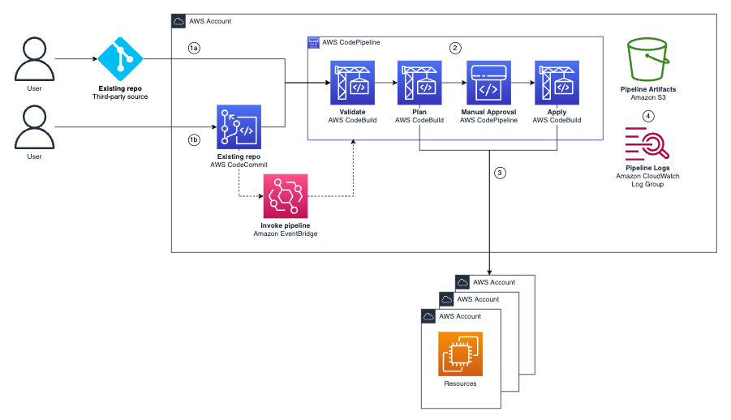

# terraform-aws-multi-account-pipeline

Deploy terraform to multiple AWS accounts.

(If you want to deploy a single AWS account use [aws-terraform-pipeline](https://github.com/aws-samples/aws-terraform-pipeline))

## Prerequisites
1. An existing AWS CodeCommit repository *OR* an [AWS CodeConnection connection](https://docs.aws.amazon.com/dtconsole/latest/userguide/welcome-connections.html) to the third-party source and repo of your choice (GitHub, Gitlab, etc)
2. [Remote state](https://developer.hashicorp.com/terraform/language/state/remote) that the pipeline can access (using the CodeBuild IAM role)
3. A cross-account IAM role in the target accounts, that can be assumed by the pipeline (using the CodeBuild IAM Role).  
4. (Optional) Your code must be compatible with the pipeline's use of [Terraform Workspaces](https://developer.hashicorp.com/terraform/language/state/workspaces) if you wish to change variables between accounts. Review the [example code directory](./example-code) and ensure your code is compatible. 
 
## Deployment

This module must be deployed to a separate repository. 

```
your repo
   modules
   backend.tf 
   config.auto.tfvars
   locals.tf 
   main.tf
   provider.tf
   variables.tf

pipeline repo 
   main.tf <--module deployed here
```

Segregation enables the pipeline to run commands against the code in "your repo" without affecting the pipeline infrastructure. Typically this could be an infrastructure or bootstrap repo for the AWS account thats used to provision infrastructure and/or multiple pipelines.

Review the [example code directory](./example-code) and ensure the code in your repo is compatible. 

## Module Inputs
AWS CodeCommit: 
```hcl
module "pipeline" {
  source        = "aws-samples/multi-account-pipeline/aws"
  version       = "1.5.x"
  pipeline_name = "pipeline"
  repo          = aws_repository.this.repository_name
  accounts      = {
    "workload1" = "112233445566"
    "workload2" = "223344556677"
    "workload3" = "334455667788"
  }
}
```
Third-party service:
```hcl
module "pipeline" {
  source        = "aws-samples/multi-account-pipeline/aws"
  version       = "1.5.x"
  pipeline_name = "pipeline"
  repo          = "organization/repo"
  connection    = aws_codestarconnections_connection.this.arn
  accounts      = {
    "workload1" = "112233445566"
    "workload2" = "223344556677"
    "workload3" = "334455667788"
  }
}
```

`pipeline_name` is used to name the pipeline and prefix other resources created, like IAM roles. 

`repo` is the name of your existing repo that the pipeline will use as a source. If you are using a third-party service, the format is "my-organization/repo"  

`accounts` is a map of the target AWS accounts. 

`connection` is the connection arn of the [connection](https://docs.aws.amazon.com/dtconsole/latest/userguide/welcome-connections.html) to the third-party repo. 

### Optional Inputs

```hcl
module "pipeline" {
  ...
  branch                = "main"
  mode                  = "SUPERSEDED"
  detect_changes        = false
  kms_key               = aws_kms_key.this.arn
  access_logging_bucket = aws_s3_bucket.this.id
  artifact_retention    = 90

  workspace_directory = "workspaces"

  codebuild_policy  = aws_iam_policy.this.arn
  build_timeout     = 10
  terraform_version = "1.7.0"
  checkov_version   = "3.2.0"
  tflint_version    = "0.55.0"

  tags = join(",", [
    "Environment[Dev,Prod]",
    "Source"
  ])
  tagnag_version = "0.7.9"

  checkov_skip = [
    "CKV_AWS_144", #Ensure that S3 bucket has cross-region replication enabled
  ]
}
```

`branch` is the branch to source. It defaults to `main`.

`mode` is [pipeline execution mode](https://docs.aws.amazon.com/codepipeline/latest/userguide/concepts-how-it-works.html#concepts-how-it-works-executions). It defaults to `SUPERSEDED`.`detect_changes` is used with third-party services, like GitHub. It enables AWS CodeConnections to invoke the pipeline when there is a commit to the repo. It defaults to `false`. 

`kms_key` is the arn of an *existing* AWS KMS key. This input will encrypt the Amazon S3 bucket with a AWS KMS key of your choice. Otherwise the bucket will be encrypted using SSE-S3. Your AWS KMS key policy will need to allow codebuild and codepipeline to `kms:GenerateDataKey*` and `kms:Decrypt`.

`access_logging_bucket` S3 server access logs bucket ARN, enables server access logging on the S3 artifact bucket.

`artifact_retention` controls the S3 artifact bucket retention period. It defaults to 90 (days). 

`workspace_directory` enables the use of workspace variable files (eg ./workspaces/<workspace>.tfvars. The input is the directory name that you wish to use. This input is recommended for advanced variable management, where complex and/or signficant amounts of different variables are applied to different AWS accounts.  

`codebuild_policy` replaces the [AWSAdministratorAccess](https://docs.aws.amazon.com/aws-managed-policy/latest/reference/AdministratorAccess.html) IAM policy. This can be used if you want to scope the permissions of the pipeline. 

`build_timeout` is the CodeBuild project build timeout. It defaults to 10 (minutes). 

`terraform_version` controls the terraform version. It defaults to 1.5.7.

`checkov_version` controls the [Checkov](https://www.checkov.io/) version. It defaults to latest.

`tflint_version` controls the [tflint](https://github.com/terraform-linters/tflint) version. It defaults to 0.48.0.

`tags` enables tag validation with [tag-nag](https://github.com/jakebark/tag-nag). Input a list of tag keys and/or tag keys and values to enforce. Input must be passed as a string, see [commands](https://github.com/jakebark/tag-nag?tab=readme-ov-file#commands). 

`tagnag_version` controls the [tag-nag](https://github.com/jakebark/tag-nag) version. It defaults to 0.5.8.

`checkov_skip` defines [Checkov](https://www.checkov.io/) skips for the pipeline. This is useful for organization-wide policies, removing the need to add individual resource skips. 

## Architecture



1. **(1a)** User commits to a third-party repository, this invokes the AWS Codepipeline pipeline; *or* **(1b)** User commits to a CodeCommit repository, this invokes an Amazon EventBridge rule, which runs the pipeline. 
2. The pipeline validates the code and then runs a terraform plan against all of the target AWS accounts. Manual approval is then required to run the terraform apply. 
3. Resources are deployed to the target AWS accounts using [Terraform Workspaces](https://developer.hashicorp.com/terraform/language/state/workspaces). Each AWS account is assigned their own Workspace using their AWS Account ID. 
4. Artifacts and logs are exported to Amazon S3 and CloudWatch logs.

## Troubleshooting

| Issue | Fix |
|---|---|
| Failed lint or validate | Read the report or logs to discover why the code has failed, then make a new commit. |
| Failed fmt | This means your code is not formatted. Run `terraform fmt --recursive` on your code, then make a new commit. |
| Failed SAST | Read the Checkov logs (Details > Reports) and either make the correction in code or add a skip to the module inputs. |
| Failed plan or apply stage | Read the report or logs to discover error in terraform code, then make a new commit. |
| Pipeline fails on apply with `the action failed because no branch named main was found ...` | Either nothing has been committed to the repo or the branch is incorrect (Eg using `Master` not `Main`). Either commit to the Main branch or change the module input to fix this. |
| `Invalid count argument` for `aws_s3_bucket_server_side_encryption_configuration` | The AWS KMS key must exist before the pipeline is created. If you create both at the same time, there is a dependency issue. |
| Unable to find state file | Check state storage :env > AWS Account ID > backend key |

## Best Practices

Permissions to your CodeCommit repository, CodeBuild projects, and CodePipeline pipeline should be tightly controlled. Here are some ideas:
- [Specify approval permission for specific pipelines and approval actions](https://docs.aws.amazon.com/codepipeline/latest/userguide/approvals-iam-permissions.html#approvals-iam-permissions-limited)
- [Using identity-based policies for AWS CodeBuild](https://docs.aws.amazon.com/codebuild/latest/userguide/auth-and-access-control-iam-identity-based-access-control.html) 
- [Limit pushes and merges to branches in AWS CodeCommit](https://docs.aws.amazon.com/codecommit/latest/userguide/how-to-conditional-branch.html)

Checkov skips can be used where Checkov policies conflict with your organization's practices or design decisions. The `checkov_skip` module input allows you to set skips for all resources in your repository. For example, if your organization operates in a single region you may want to add `CKV_AWS_144` (Ensure that S3 bucket has cross-region replication enabled). For individual resource skips, you can still use [inline code comments](https://www.checkov.io/2.Basics/Suppressing%20and%20Skipping%20Policies.html).

## Related Resources

- [aws-terraform-pipeline](https://github.com/aws-samples/aws-terraform-pipeline)
- [Terraform Workspaces](https://developer.hashicorp.com/terraform/language/state/workspaces)
- [Terraform Registry: aws-samples/multi-account-pipeline/aws](https://registry.terraform.io/modules/aws-samples/multi-account-pipeline/aws/latest)

## Security

See [CONTRIBUTING](CONTRIBUTING.md#security-issue-notifications) for more information.

## License

This library is licensed under the MIT-0 License. See the LICENSE file.

