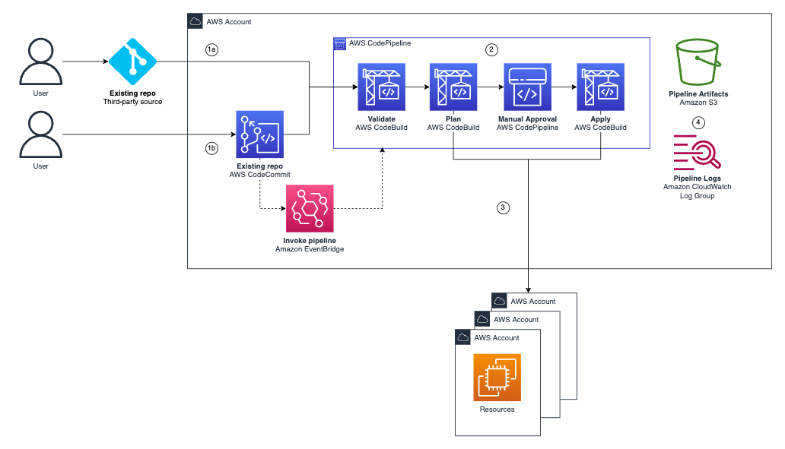
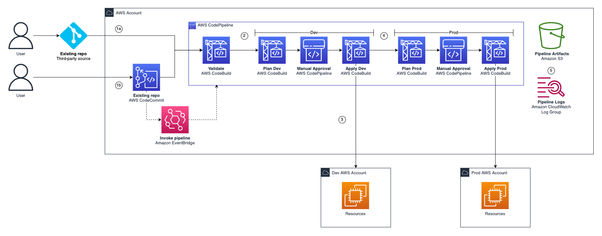

# Architecture

## Paralell Deployment (default)

1. **(1a)** User commits to a third-party repository, this invokes the AWS Codepipeline pipeline; *or* **(1b)** User commits to a CodeCommit repository, this invokes an Amazon EventBridge rule, which runs the pipeline. 
2. The pipeline validates the code and then runs a terraform plan against all of the target AWS accounts. Manual approval is then required to run the terraform apply. 
3. Resources are deployed to the target AWS accounts using [Terraform Workspaces](https://developer.hashicorp.com/terraform/language/state/workspaces). Each AWS account is assigned their own Workspace using their AWS Account ID.
4. Artifacts and logs are exported to Amazon S3 and CloudWatch logs.

## Sequential Deployment

1. **(1a)** User commits to a third-party repository, this invokes the AWS Codepipeline pipeline; *or* **(1b)** User commits to a CodeCommit repository, this invokes an Amazon EventBridge rule, which runs the pipeline. 
2. The pipeline validates the code and then progresses through the various stages (Dev then Prod in the above image). Each stage has a plan, approval, and apply. 
3. Resources are deployed to the target AWS accounts using [Terraform Workspaces](https://developer.hashicorp.com/terraform/language/state/workspaces). Each AWS account is assigned their own Workspace using their AWS Account ID. 
4. After applying to the first AWS account ("Dev") the pipeline progresses to the same for the next stage ("Prod").  
5. Artifacts and logs are exported to Amazon S3 and CloudWatch logs.

## Pipeline Validation

| Check | Description |
|---|---|
| validate | runs `terraform validate` to make sure that the code is syntactically valid. |
| lint | runs [tfLint](https://github.com/terraform-linters/tflint) which will find errors, depreciated syntax, and check naming conventions. |
| fmt | runs `terraform fmt --recursive --check` to ensure code is consistently formatted. |
| sast | runs [checkov](https://www.checkov.io/) for security best practices. |
| tags (optional)| runs [tag-nag](https://github.com/jakebark/tag-nag) to validate tags.|
